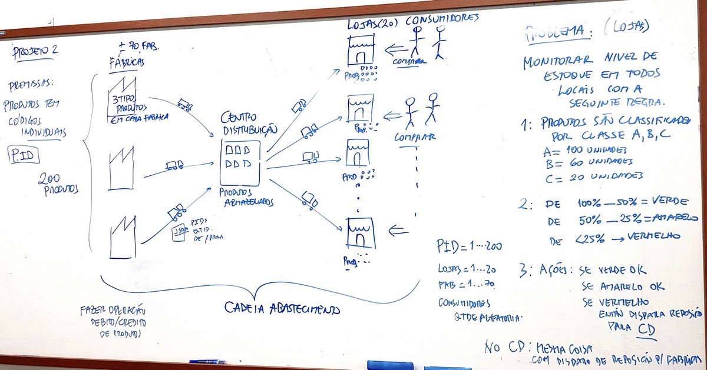

<!--
*** Thanks for checking out the Best-README-Template. If you have a suggestion
*** that would make this better, please fork the repo and create a pull request
*** or simply open an issue with the tag "enhancement".
*** Thanks again! Now go create something AMAZING! :D
***
***
***
*** To avoid retyping too much info. Do a search and replace for the following:
*** github_username, repo_name, twitter_handle, email, project_title, project_description
-->

<!-- PROJECT SHIELDS -->
<!--
*** I'm using markdown "reference style" links for readability.
*** Reference links are enclosed in brackets [ ] instead of parentheses ( ).
*** See the bottom of this document for the declaration of the reference variables
*** for contributors-url, forks-url, etc. This is an optional, concise syntax you may use.
*** https://www.markdownguide.org/basic-syntax/#reference-style-links
-->

<!-- [![Contributors][contributors-shield]][contributors-url]
[![Forks][forks-shield]][forks-url]
[![Stargazers][stars-shield]][stars-url]
[![Issues][issues-shield]][issues-url]
[![MIT License][license-shield]][license-url]
[![LinkedIn][linkedin-shield]][linkedin-url] -->

<!-- PROJECT LOGO -->
<br />
<p align="center">
  <!-- <a href="https://github.com/brnom/stock-management">
    
  </a> -->

  <h2 align="center">Stock Management</h2>

  <!-- <p align="center">
    project_description
    <br />
    <a href="https://github.com/brnom/stock-management"><strong>Explore the docs »</strong></a>
    <br />
    <br />
    <a href="https://github.com/brnom/stock-management">View Demo</a>
    ·
    <a href="https://github.com/brnom/stock-management/issues">Report Bug</a>
    ·
    <a href="https://github.com/brnom/stock-management/issues">Request Feature</a>
  </p> -->
</p>

<!-- TABLE OF CONTENTS -->
<details open="open">
  <summary><h2 style="display: inline-block">Table of Contents</h2></summary>
  <ol>
    <li>
      <a href="#about-the-project">About The Project</a>
      <ul>
        <li><a href="#built-with">Built With</a></li>
      </ul>
    </li>
    <li>
      <a href="#getting-started">Getting Started</a>
      <ul>
        <li><a href="#prerequisites">Prerequisites</a></li>
        <li><a href="#installation">Installation</a></li>
      </ul>
    </li>
    <li><a href="#usage">Usage</a></li>
    <li><a href="#roadmap">Roadmap</a></li>
    <li><a href="#contributing">Contributing</a></li>
    <li><a href="#license">License</a></li>
    <li><a href="#contact">Contact</a></li>
    <li><a href="#acknowledgements">Acknowledgements</a></li>
  </ol>
</details>

<!-- ABOUT THE PROJECT -->

## About The Project

<!-- Projeto de implementação de solução distribuída para monitoramento de níveis de estoque de produtos em lojas de varejo e centro de distribuição (CD). -->
<!-- translate -->

Project that implements a distributed solution to monitor product stock levels at stores and distribution centers



<!-- Partir de níveis de estoque diferentes de Zero em todas lojas para todos produtos. Simular compra de produtos por clientes aleatórios nas lojas. Toda compra produz débito no nível de estoque de um determinado produto - mostrar Níveis de estoque em Verde/Amarelo/Vermelho - quando uma venda provocar Vermelho, disparar pedido (mensagem no tópico reposição) de reposição de produto para CD. Usar mesma estratégia para CD, quando nível atingir o Vermelho, precisa disparar pedido de reposição para fábricas. Quando chegar uma mensagem de reposição de produtos (no tópico Reabastecimento(produto)) a loja ou CD realiza uma operação de Crédito. Assim venda provoca Débito na quantidade de produtos na loja, reabastecimento provoca Crédito .. mesma coisa no CD. Nas fábricas não precisa controlar níveis de estoque.. Lembre-se que o nível de estoque no CD deve ser semelhante ao (nível da loja) \* (nro de lojas). -->
<!-- translate -->

Start with stock levels different from zero for all stores and products. Mock product sales by random clients at stores. Every sale debits the current stock level from a given product - show levels by colors. When a sale provocks* a Red level, dispatch a buy order (message on reposition* topic) to the distribution center (DC). Apply same logic to the DC, where it requires products from fabrics.
When a buy order is done, both DC and stores recieve* a credit. Fabrics don't need stock management. DC stock level is equal the number of stores * their stock level.

### Built With

- [Python](https://www.python.org)
- [Docker](https://www.docker.com)
- [HiveMQ](https://www.hivemq.com)

<!-- GETTING STARTED -->

## Getting Started

To get a local copy up and running follow these simple steps.

### Prerequisites

You need to have docker installed. For more info, check [this](https://docs.docker.com/engine/install/) link.

### Installation

1. Clone the repo
   ```sh
   git clone https://github.com/brnom/stock-management.git
   ```
2. Build and execute docker containers
   ```sh
   docker compose up
   ```

<!-- USAGE EXAMPLES -->

## Usage

Use this space to show useful examples of how a project can be used. Additional screenshots, code examples and demos work well in this space. You may also link to more resources.

_For more examples, please refer to the [Documentation](https://example.com)_

<!-- ROADMAP -->

## Roadmap

See the [open issues](https://github.com/brnom/stock-management/issues) for a list of proposed features (and known issues).

<!-- CONTRIBUTING -->

## Contributing

Contributions are what make the open source community such an amazing place to be learn, inspire, and create. Any contributions you make are **greatly appreciated**.

1. Fork the Project
2. Create your Feature Branch (`git checkout -b feature/AmazingFeature`)
3. Commit your Changes (`git commit -m 'Add some AmazingFeature'`)
4. Push to the Branch (`git push origin feature/AmazingFeature`)
5. Open a Pull Request

<!-- LICENSE -->

## License

Distributed under the MIT License. See `LICENSE` for more information.

<!-- CONTACT -->

## Contact

Your Name - [@twitter_handle](https://twitter.com/twitter_handle) - email

Project Link: [https://github.com/brnom/stock-management](https://github.com/brnom/stock-management)

<!-- ACKNOWLEDGEMENTS -->

## Acknowledgements

<!-- BEST README TEMPLATE -->
<!-- WAIT FOR IT -->

- []()
- []()
- []()

<!-- MARKDOWN LINKS & IMAGES -->
<!-- https://www.markdownguide.org/basic-syntax/#reference-style-links -->

[contributors-shield]: https://img.shields.io/github/contributors/github_username/repo.svg?style=for-the-badge
[contributors-url]: https://github.com/github_username/repo/graphs/contributors
[forks-shield]: https://img.shields.io/github/forks/github_username/repo.svg?style=for-the-badge
[forks-url]: https://github.com/github_username/repo/network/members
[stars-shield]: https://img.shields.io/github/stars/github_username/repo.svg?style=for-the-badge
[stars-url]: https://github.com/github_username/repo/stargazers
[issues-shield]: https://img.shields.io/github/issues/github_username/repo.svg?style=for-the-badge
[issues-url]: https://github.com/github_username/repo/issues
[license-shield]: https://img.shields.io/github/license/github_username/repo.svg?style=for-the-badge
[license-url]: https://github.com/github_username/repo/blob/master/LICENSE.txt
[linkedin-shield]: https://img.shields.io/badge/-LinkedIn-black.svg?style=for-the-badge&logo=linkedin&colorB=555
[linkedin-url]: https://linkedin.com/in/github_username
